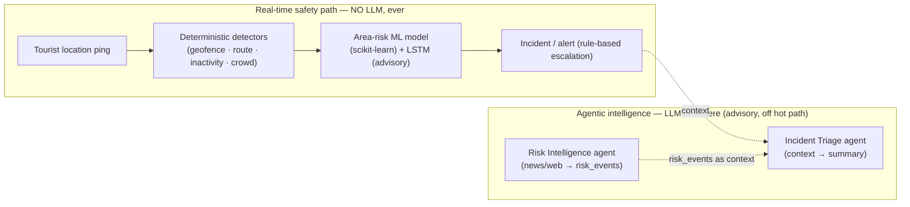
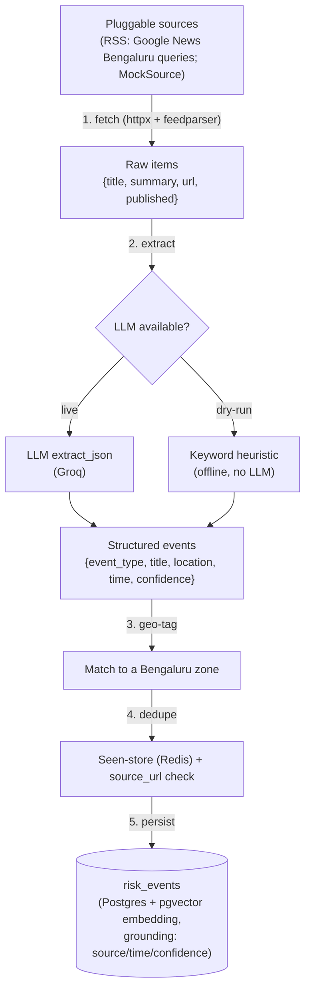
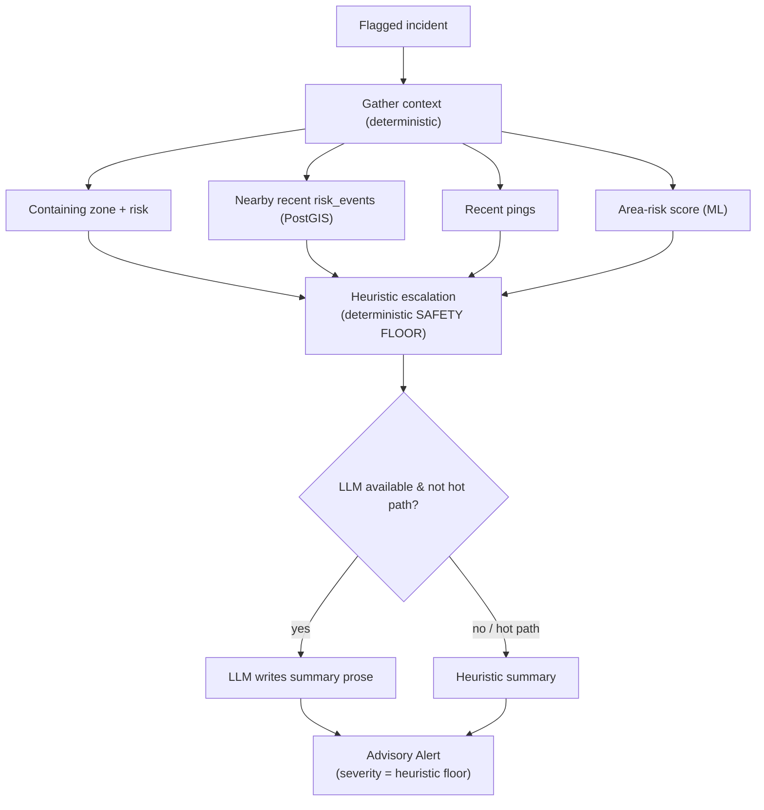
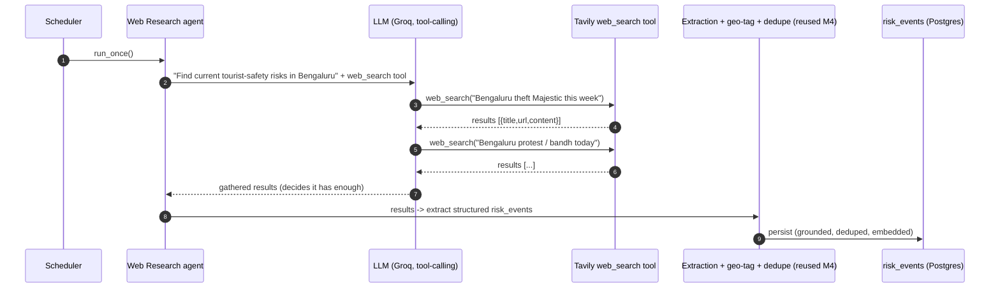
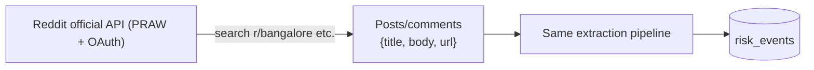

# Agent & LLM Implementation

How the AI/LLM layer of the Tourist Safety platform works **today**, and how it
will **expand** to search the live web (Tavily) and social/community sources
(Reddit) in the future. This is the deep-dive companion to
[DOCUMENTATION.md](DOCUMENTATION.md).

---

## Table of contents
1. [The golden rule: where LLMs are (and aren't) used](#1-the-golden-rule-where-llms-are-and-arent-used)
2. [The provider-agnostic LLM wrapper](#2-the-provider-agnostic-llm-wrapper)
3. [Agent 1 — Risk Intelligence (current)](#3-agent-1--risk-intelligence-current)
4. [Agent 2 — Incident Triage (current)](#4-agent-2--incident-triage-current)
5. [Dry-run vs live, grounding, dedup, rate limits](#5-dry-run-vs-live-grounding-dedup-rate-limits)
6. [Where the data is shown](#6-where-the-data-is-shown)
7. [FUTURE — Web Research agent (Tavily + tool-calling)](#7-future--web-research-agent-tavily--tool-calling)
8. [FUTURE — Reddit & other sources](#8-future--reddit--other-sources)
9. [API keys & environment](#9-api-keys--environment)
10. [Guardrails, legality & ethics](#10-guardrails-legality--ethics)
11. [Testing strategy](#11-testing-strategy)

---

## 1. The golden rule: where LLMs are (and aren't) used

The system has two layers. **The LLM lives only in the second one.**



- **A tourist's location, safety score, route-deviation, and panic never call an
  LLM.** Those are geometry + a classical ML model — fast and predictable.
- **The LLM only**: (a) turns external text (news/web) into structured
  `risk_events`, and (b) writes the human-readable triage summary.
- The **escalation level** is always a deterministic rule (a "safety floor") —
  an LLM can enrich the wording but can never downgrade a serious incident.

---

## 2. The provider-agnostic LLM wrapper

All LLM calls go through one thin module — [app/services/llm.py](backend/app/services/llm.py).

- **Provider-agnostic:** Groq by default, via the **OpenAI-compatible API**
  (we use the OpenAI SDK pointed at Groq's `base_url`). Provider, base URL,
  model, and key all come from env — switching providers is an env change, not a
  code change.
- **Dry-run mode:** when there's no key (or `LLM_DRY_RUN=true`), the wrapper
  returns canned/heuristic output, so the entire agent layer is testable with
  **no key and no network**.
- **TLS:** behind a TLS-intercepting proxy, [tls.py](backend/app/services/tls.py)
  routes Python SSL through the OS trust store so the live call succeeds.

```python
# Simplified shape
client = LLMClient()              # reads env; dry_run if no key
result = client.extract_json(system_prompt, user_text)   # -> dict (parsed JSON)
```

Env: `LLM_PROVIDER`, `LLM_BASE_URL`, `LLM_API_KEY`, `LLM_MODEL`, `LLM_DRY_RUN`.

---

## 3. Agent 1 — Risk Intelligence (current)

**Job:** answer *"what's happening around Bengaluru that affects tourist
safety?"* by reading external text and producing structured, geo-tagged
`risk_events`. Code: [app/agents/risk_intelligence.py](backend/app/agents/risk_intelligence.py).



### The exact LLM call
**System prompt** (paraphrased from the code):
> *"You extract structured public-safety risk events for tourists in Bengaluru
> from news snippets. Return STRICT JSON:
> `{events:[{event_type, title, description, location_name, lat, lon, event_time,
> confidence}]}`. Only include safety-relevant events; if none, return
> `{events:[]}`."*

**Example**

```text
INPUT (raw news text):
  Title: Chain snatching reported near Majestic bus stand
  Summary: Police report a rise in chain-snatching incidents around the
  Kempegowda (Majestic) bus terminus late at night.

OUTPUT (LLM → strict JSON):
  { "events": [{
      "event_type": "crime",
      "title": "Chain snatching near Majestic bus stand",
      "location_name": "Majestic",
      "confidence": 0.8
  }] }
```

So the LLM's only job here is **extraction/classification**: messy human text →
clean typed fields. It does **not** decide anyone's safety.

### Sources (today)
[app/agents/sources.py](backend/app/agents/sources.py) defines a `RiskSource`
protocol so sources are pluggable + mockable:
- `RSSSource` — Google News RSS queries (Bengaluru crime / protest / weather).
- `MockSource` — canned items for dry-run/tests.

Runs on a schedule ([scheduler.py](backend/app/agents/scheduler.py), throttled)
or one-shot via `scripts/run_risk_agent.py` (`--live` for real RSS + LLM).

---

## 4. Agent 2 — Incident Triage (current)

**Job:** when an incident is flagged, gather context and write a concise,
**advisory** summary + recommended escalation. Code:
[app/agents/triage.py](backend/app/agents/triage.py).



Key points:
- The **escalation level is a deterministic rule**; the LLM only writes the prose.
- On the **real-time API path** (ingest/panic), triage runs in **heuristic mode**
  so a tourist's request never blocks on a live LLM call. The live LLM is
  reserved for scheduled/offline enrichment.
- Output is **advisory only** — a human acts on it.

---

## 5. Dry-run vs live, grounding, dedup, rate limits

| Concern | How it's handled |
|---|---|
| **No key / offline** | Dry-run mode: heuristic extraction + canned sources. Everything runs and is tested without keys. |
| **Grounding** | Every `risk_event` stores `source`, `source_url`, `event_time`, `confidence` + a 384-d embedding — a human can always verify. |
| **Dedup** | A Redis (or in-memory) **seen-store** + a `source_url` existence check avoid re-processing/re-calling the LLM on unchanged items. |
| **Rate limits** | Scheduled runs are throttled; per-item failures (e.g. Groq HTTP 429) are logged and skipped, never fatal. |
| **Cost** | The hot path is LLM-free; the LLM runs only on a schedule over deduped items. |

> Current state: the `risk_events` you see now came from the **seed script**
> (`source: seed:synthetic`) and the **dry-run agent** (heuristic over mock news).
> A real Groq call happens only with `--live` and a non-rate-limited key.

---

## 6. Where the data is shown

- **Police Dashboard → "Risk events (crime & hazards) — police only"** panel
  (via `GET /police/risk-events`).
- As **context inside an incident's triage summary**.
- **Tourists never see risk events** — only their own safety score. (Role
  separation enforced by JWT on both API and UI.)

---

## 7. FUTURE — Web Research agent (Tavily + tool-calling)

**Goal:** instead of only fixed RSS feeds, let an agent **actively search the
live web** for current Bengaluru safety information, then extract it into the
same `risk_events`.

**Chosen design:** an **LLM with a `web_search` tool** (function-calling) backed
by the **Tavily** search API (a search API built for AI agents; free tier).



**Why tool-calling:** the LLM decides *what* to search for (and can search again
if results are thin), which is more flexible than fixed queries — while the
**existing M4 pipeline is reused** for extraction → zone geo-tagging → dedup →
persistence (so it lands in the same table and UI).

**Components to add (planned):**
- `TAVILY_API_KEY` config + a graceful `web_search()` tool ([app/agents/tools.py]).
- A tool-calling loop in the LLM wrapper (Groq supports OpenAI-style `tools`).
- A `WebResearchAgent` that, in **dry-run**, uses fixed queries + mock results
  (fully offline/testable), and in **live** uses the tool-calling loop.
- A `scripts/run_web_research.py` runner (dry-run default, `--live`).

**Plugs in cleanly** because it's just another producer of `risk_events` — no DB
or UI changes.

---

## 8. FUTURE — Reddit & other sources

### Reddit (community chatter) — via the **official API only**

- Search subreddits (e.g. `r/bangalore`) for safety chatter through the
  **official Reddit API** (registered app, OAuth) — valid for low-volume use.
- **Scraping Reddit/Instagram HTML is against ToS** and is *not* planned.
- **Instagram is excluded**: no public search API; scraping violates ToS and is
  legally risky — so it is intentionally **not** a source.

### Other high-value, valid sources (planned/optional)
- **Government / official feeds**: Bengaluru Police advisories, **IMD weather**,
  traffic — highest-signal, fully legitimate.
- **Web-search alternatives**: Brave Search API, Bing News — same pattern as
  Tavily.
- **News APIs**: NewsAPI / GNews (free tiers).

All of these reuse the exact same **extract → geo-tag → dedupe → persist**
pipeline; each is just a new pluggable source.

---

## 9. API keys & environment

| Key | Status | Used for | Where to get it |
|---|---|---|---|
| `LLM_API_KEY` (Groq) | **Active** (rate-limited free key) | All LLM extraction/triage | console.groq.com |
| `TAVILY_API_KEY` | **Planned** | Web Research agent search | tavily.com (free tier) |
| Reddit client id/secret | **Planned (optional)** | Reddit source | reddit.com/prefs/apps |
| Brave / Bing / NewsAPI | **Optional alternatives** | Extra search/news | respective consoles |

All keys live in `backend/.env` (gitignored). **Everything runs in dry-run with
no keys at all** — keys only enable the *live* paths.

---

## 10. Guardrails, legality & ethics

- **Official APIs only** — no scraping of social platforms; respect ToS &
  robots.txt. **Instagram is out** (no public API, ToS/legal/ban risk).
- **Grounding** — every AI-emitted signal keeps `source` + URL + `confidence`, so
  web/social content (which can be rumor) is always human-verifiable.
- **Privacy (DPDP)** — extract safety *facts* ("theft reports near Majestic"),
  not profiles of identifiable individuals.
- **Advisory only** — agents never dispatch responders or gate the real-time
  safety path; the deterministic layer is the floor.
- **Rate/cost control** — throttle scheduled runs, dedupe, skip unchanged items,
  tolerate provider 429s.

---

## 11. Testing strategy

- **Dry-run everywhere**: agents run with mock sources + heuristic extraction, so
  the full pipeline is tested with **no keys and no network**.
- **Mockable tools**: the future `web_search`/Reddit tools return canned results
  in tests; the live API call is the only untested-without-keys part.
- **Grounding assertions**: tests verify every persisted `risk_event` has
  `source`, `event_time`, `confidence`, and an embedding, and that dedup works.

---

*Companion docs: [DOCUMENTATION.md](DOCUMENTATION.md) (full project) and the
per-service READMEs under [backend/](backend/).*
