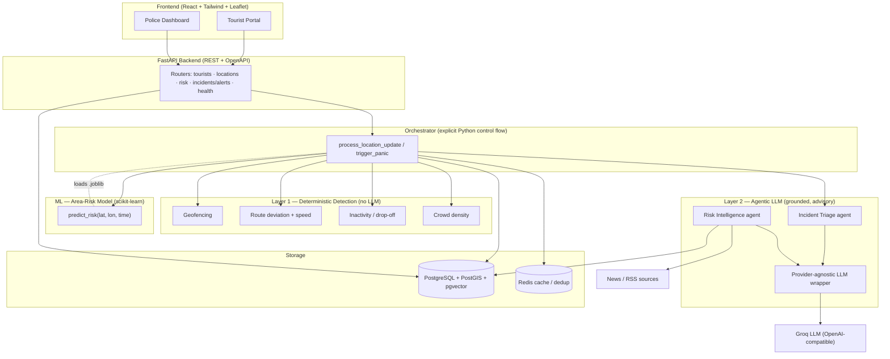
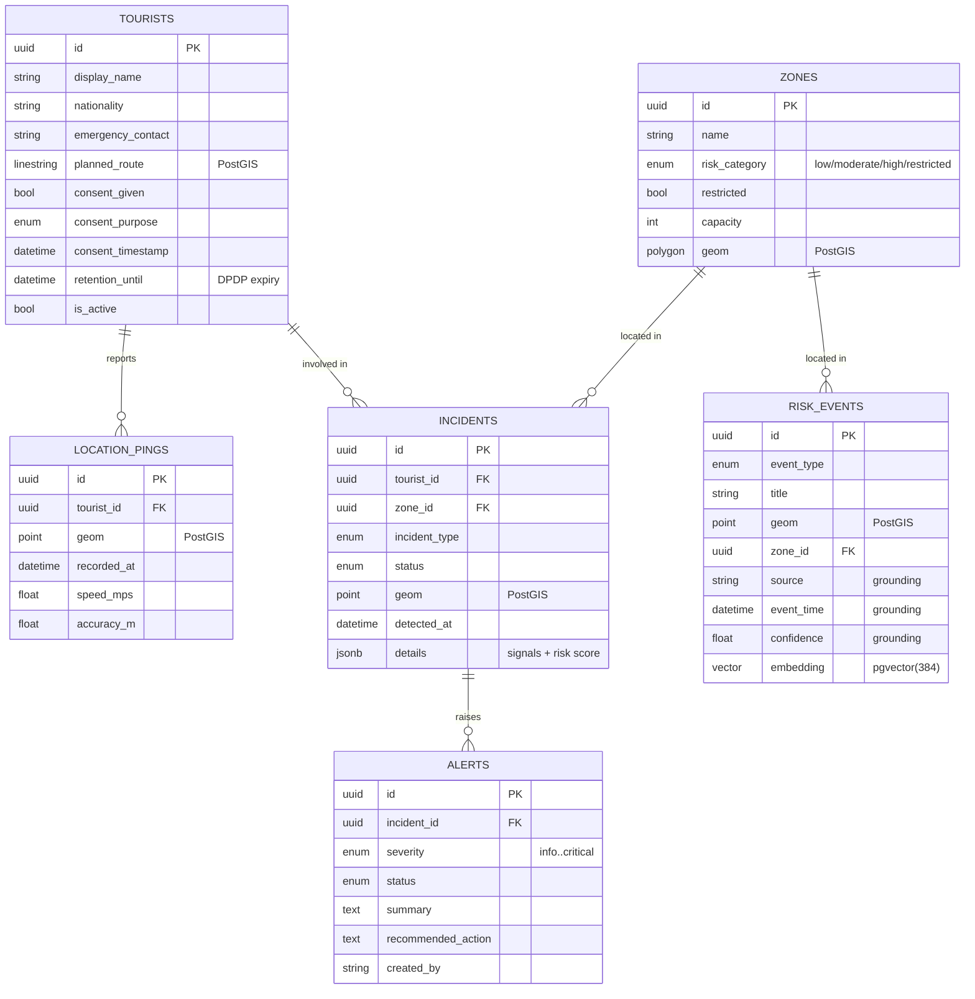
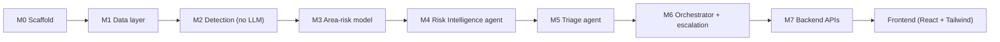
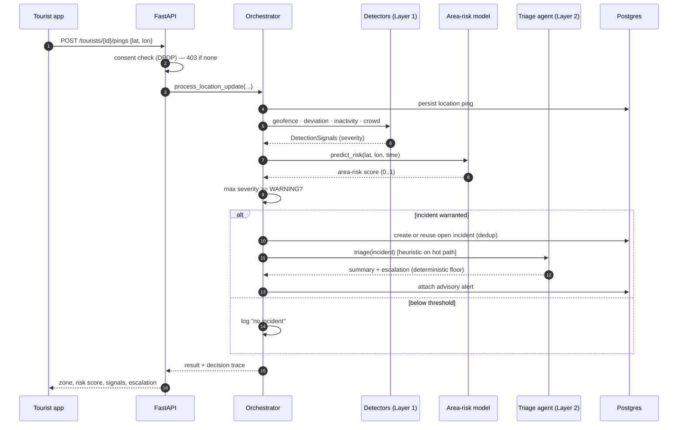

# Tourist Safety & Incident Intelligence — Full Project Documentation

> An AI-orchestrated, multi-agent platform that monitors tourists in real time,
> predicts how risky an area is, detects distress (route deviation, inactivity,
> signal drop-off, crowding), ingests live risk events from the news, and
> prepares **decision-ready, advisory alerts** for human authorities.

This document explains the project end to end: what it is, why it exists, the
architecture, every technology and why it was chosen, the data, how it was built
milestone by milestone, the design guardrails, and how to run and extend it.

---

## Table of contents

1. [What this project is](#1-what-this-project-is)
2. [Why it's needed (the problem)](#2-why-its-needed-the-problem)
3. [Core idea: a two-layer hybrid design](#3-core-idea-a-two-layer-hybrid-design)
4. [System architecture (diagram)](#4-system-architecture-diagram)
5. [Technology stack — what and why](#5-technology-stack--what-and-why)
6. [Repository structure](#6-repository-structure)
7. [The data model (diagram)](#7-the-data-model-diagram)
8. [The data — what we use and why it's synthetic](#8-the-data--what-we-use-and-why-its-synthetic)
9. [How it was built — milestone by milestone](#9-how-it-was-built--milestone-by-milestone)
10. [Component deep-dives](#10-component-deep-dives)
11. [The escalation flow (sequence diagram)](#11-the-escalation-flow-sequence-diagram)
12. [Design principles & guardrails](#12-design-principles--guardrails)
13. [Privacy & DPDP compliance](#13-privacy--dpdp-compliance)
14. [Running the project](#14-running-the-project)
15. [Testing](#15-testing)
16. [Environment quirks we handled](#16-environment-quirks-we-handled)
17. [Extending to more cities](#17-extending-to-more-cities)
18. [Roadmap / future work](#18-roadmap--future-work)
19. [Glossary](#19-glossary)

---

## 1. What this project is

A backend platform plus a web UI for **tourist safety and incident
intelligence**. It continuously receives a tourist's location, runs fast safety
checks, scores how dangerous the surrounding area is, watches external risk
signals (crime/weather/unrest news), and—when something looks wrong—creates an
**incident**, drafts a human-readable **triage summary**, and recommends an
**escalation level** for a control-room operator to act on.

There are two front-facing roles, both delivered as one React app:

- **Tourist Portal** — a person registers (with consent), shares their location,
  and can hit a **panic button**.
- **Police / Authority Dashboard** — operators see a live map of risk zones,
  open incidents, advisory alerts, and can look up the risk of any point.

The system is **decision support**: it never dispatches responders by itself. A
human always makes the call.

---

## 2. Why it's needed (the problem)

Tourists are disproportionately exposed to risk: they don't know which areas are
unsafe, they wander off planned routes, they lose signal in remote areas, and
they're targets for theft in crowded transit hubs. Authorities, meanwhile, are
flooded with raw data and have no way to triage it.

The platform addresses four concrete needs:

| Need | How the platform helps |
|---|---|
| **"Is this area safe right now?"** | A trained spatiotemporal model returns a risk score for any `(location, time)`. |
| **"Is this tourist in trouble?"** | Deterministic detectors flag route deviation, inactivity/signal loss, restricted-zone entry, and crowding within milliseconds. |
| **"What's happening around them?"** | An LLM agent reads news/RSS and extracts geo-tagged risk events (crime, floods, protests). |
| **"What should the operator do?"** | A triage agent gathers all context into a concise summary + recommended escalation level. |

Crucially, the system is built so that the *life-safety-critical* detections are
**fast, deterministic, and never depend on an LLM** — because an LLM
hallucinating "all clear" during an emergency is the worst possible failure.

---

## 3. Core idea: a two-layer hybrid design

The single most important architectural decision is the **separation of two
layers**:

```
┌─────────────────────────────────────────────────────────────┐
│  LAYER 1 — FAST DETERMINISTIC DETECTION  (no LLM, ever)       │
│  Geometry, rules, thresholds, a classical ML score.          │
│  Runs on every location ping in milliseconds.                │
│  Geofencing · Route deviation · Inactivity · Crowd density   │
└─────────────────────────────────────────────────────────────┘
                              │  signals + risk score
                              ▼
┌─────────────────────────────────────────────────────────────┐
│  LAYER 2 — AGENTIC LLM INTELLIGENCE  (advisory, off hot path)│
│  Grounded LLM agents that summarize, explain, and enrich.    │
│  Risk Intelligence agent (news → risk events)                │
│  Incident Triage agent (context → summary + escalation)      │
└─────────────────────────────────────────────────────────────┘
```

- **Layer 1** decides *whether* something is wrong. It is pure Python geometry /
  thresholds plus a classical scikit-learn model. Predictable, testable, fast.
- **Layer 2** explains *what* it means and *what to do*. LLM output is always
  **grounded** (carries `source`, `timestamp`, `confidence`) and **advisory**.

The escalation **level** is always computed by deterministic rules (a "safety
floor"); the LLM only writes the prose. An LLM can never *downgrade* a serious
incident.

---

## 4. System architecture (diagram)



---

## 5. Technology stack — what and why

### Backend / core

| Technology | Used for | Why this choice |
|---|---|---|
| **Python 3.11+** | Whole backend, ML, agents | Best ecosystem for geospatial + ML + web; team familiarity. |
| **FastAPI + Uvicorn** | REST API, ASGI server | Async, fast, **auto OpenAPI/Swagger docs**, native Pydantic integration. |
| **Pydantic v2** | All request/response & config validation | Strong typing at I/O boundaries; catches bad data early. |
| **PostgreSQL** | Primary datastore | Reliable, relational, transactional — fits incidents/alerts/consent. |
| **PostGIS** | Geospatial queries | We constantly ask "is this point in this polygon?", "what's within 2 km?". PostGIS does point-in-polygon, distance, and spatial indexing natively — far better than doing geometry in app code. |
| **pgvector** | Risk-event embeddings | Lets agents retrieve *semantically similar* past risk events via vector similarity, in the same database. |
| **SQLAlchemy 2 + GeoAlchemy2** | ORM + geometry columns | Typed models; GeoAlchemy2 maps PostGIS geometry to Python/Shapely cleanly. |
| **Alembic** | DB migrations | Versioned, reversible schema changes; enables `postgis`/`vector` extensions in a migration. |
| **Redis** | Live cache + dedup + pub/sub bus | Fast ephemeral store for the live-location cache and the agent's "already-seen" set so we don't re-process or re-call the LLM. |
| **Shapely + geopy** | Geometry & distance math | Shapely for projections/containment; geopy for accurate **geodesic** distances in meters. |
| **scikit-learn (HistGradientBoostingClassifier)** | The area-risk model | Classical, tabular, CPU-only, fast to train and serve. No GPU/deep-learning needed for this signal. |
| **pandas / numpy** | Feature engineering, dataset simulation | Standard data tooling; vectorized Poisson simulation. |
| **joblib** | Model serialization | Standard for scikit-learn artifacts; the model is a self-contained `.joblib` bundle. |
| **Groq (via the OpenAI SDK)** | LLM for the agents | Free tier, **OpenAI-compatible API**, fast inference. Used through a thin provider-agnostic wrapper so the provider is an env change, not a code change. |
| **feedparser + httpx + beautifulsoup4** | Fetching/parsing news & RSS | `feedparser` for RSS, `httpx` for HTTP, `bs4` available for HTML parsing. |
| **APScheduler** | Periodic agent runs | Throttled scheduled execution of the Risk Intelligence agent (respects free-tier limits). |
| **truststore** | TLS behind corporate proxies | Routes Python TLS through the OS certificate store so live LLM/RSS calls work behind TLS-intercepting networks. |
| **uv** | Python packaging / venv | Extremely fast, reproducible installs; single `pyproject.toml`. |
| **Docker + docker-compose** | Local infra (Postgres+PostGIS+pgvector, Redis, app) | One command brings up the whole stack; reproducible across machines. |
| **pytest** | Testing | The de-facto Python test framework; **90 tests** across the codebase. |
| **ruff** | Lint + format | Fast, all-in-one linter/formatter. |

### Frontend

| Technology | Used for | Why |
|---|---|---|
| **React 18 + Vite 6** | SPA + dev server/bundler | Component model; Vite gives instant HMR and a built-in dev proxy. |
| **Tailwind CSS v4** | Styling | Utility-first, fast to build a clean modern UI; CSS-first config via the Vite plugin. |
| **react-leaflet / Leaflet** | Interactive map | Renders zone polygons (colored by risk) + incident/location markers using free OpenStreetMap tiles. |
| **react-router-dom** | Routing | Two views (Dashboard, Tourist Portal) in one app. |
| **lucide-react** | Icons | Clean, lightweight, consistent icon set. |

The dev server **proxies `/api/*` → the FastAPI backend on `:8000`**, so there's
no CORS configuration and no hardcoded backend URL in the frontend.

---

## 6. Repository structure

```
AI_tourist_safety/
├── README.md                 # repo overview
├── DOCUMENTATION.md          # this file
├── backend/                  # all Python — self-contained, runnable on its own
│   ├── app/
│   │   ├── api/              # FastAPI routers + serializers + dependencies
│   │   ├── core/            # config (env), logging
│   │   ├── db/              # SQLAlchemy models, session, spatial helpers, migrations
│   │   ├── detection/       # Layer 1: geofence, route_deviation, inactivity, crowd
│   │   ├── ml/              # Area-risk model: priors, features, dataset, train/predict
│   │   ├── agents/          # Layer 2: risk_intelligence, triage, sources, scheduler
│   │   ├── orchestrator/    # explicit escalation controller
│   │   ├── services/        # llm wrapper, embeddings, redis, retention, tls
│   │   └── main.py          # FastAPI app entrypoint
│   ├── scripts/             # seed + demo scripts (synthetic, detection, triage, orchestrator, risk agent)
│   ├── notebooks/           # Colab training notebook (self-contained)
│   ├── tests/               # pytest suite
│   ├── models/              # trained .joblib artifact (gitignored)
│   ├── docker-compose.yml   # postgres(+postgis+pgvector), redis, app
│   ├── Dockerfile           # app image (auto-migrates on start)
│   ├── alembic.ini
│   ├── pyproject.toml        # uv-managed deps
│   └── .env.example
└── frontend/                 # React + Tailwind UI
    ├── src/
    │   ├── components/      # Layout, ZoneMap, Drawer, IncidentDetail, ui primitives
    │   ├── pages/           # Dashboard, TouristPortal
    │   └── lib/             # api client, formatting/severity helpers
    ├── vite.config.js        # dev proxy /api -> :8000
    └── package.json
```

---

## 7. The data model (diagram)



**Why this shape:**
- Every geo entity stores a real **PostGIS geometry** (point/polygon/linestring),
  enabling spatial SQL.
- `risk_events` carry **grounding fields** (`source`, `event_time`, `confidence`)
  and a **384-dim embedding** — the rule that *every AI-emitted signal must be
  traceable*.
- `incidents.details` is JSONB holding the exact detection signals + area-risk
  score that triggered it → full **decision traceability**.
- `tourists` model **consent and retention** as first-class fields (DPDP).

---

## 8. The data — what we use and why it's synthetic

### Operational data (Bengaluru)
The system is anchored to **Bengaluru, India**. The seed creates 6 realistic
zones (Majestic transit hub, MG Road, Koramangala, Electronic City, Cubbon Park,
and the restricted Bannerghatta forest fringe), tourists with consent and planned
routes, and **trajectories** in three scenarios — *normal*, *deviating*, and
*going-silent* — which double as test fixtures for the detection layer.

### Training data for the area-risk model (and why it's synthetic)
India has **no public point-level (lat/lon + timestamp) crime dataset**. So,
per design, we:
1. Use **real published aggregates** (NCRB "Crime in India" metropolitan tables,
   data.gov.in, Bengaluru City Police summaries) as **zone-level priors** —
   relative risk intensities per area.
2. **Generate synthetic, geocoded + timestamped incidents** conditioned on those
   priors plus realistic **time-of-day / day-of-week** patterns.

This produces a fully reproducible dataset and an honest learning task: the model
must recover risk from coordinates + time + recent counts, not be handed the
answer.

**Dataset at a glance (default run):**

| Property | Value |
|---|---|
| Grid | 30 × 30 = **900 cells** (~1.1 km each) over Bengaluru |
| Simulated period | **90 days** hourly = 2,160 hours → 1.94M cell-hours |
| Total simulated incidents | ~**41,000** (Poisson-distributed) |
| Training rows sampled | **60,000** (45k train / 15k test) |
| Positive rate | **11.5%** |
| Model | `HistGradientBoostingClassifier` |
| **ROC-AUC** | **0.658** · Avg-precision 0.209 · Accuracy 0.886 |

> The numeric priors are **approximate and easy to tune** — drop in better
> figures and retrain; no code changes needed.

---

## 9. How it was built — milestone by milestone

The project was built **incrementally**, one milestone at a time, each with its
own tests and a runnable demo, and each starting with a short plan and a
question-driven check-in before any code. A notable mid-project decision was
re-anchoring the synthetic geography from Goa to **Bengaluru** at the user's
request, and wiring a real **Groq** key for the live agent path.



### M0 — Scaffold
Repo structure, `pyproject.toml` (uv), Docker Compose for **Postgres+PostGIS+
pgvector** and **Redis**, settings/logging modules, a FastAPI app with
`/health` + `/health/ready` (live DB/Redis checks), and a test harness.
**Done when:** `docker compose up` brings up infra + API; health checks pass.

### M1 — Data layer
Six SQLAlchemy + GeoAlchemy2 models (tourists, location_pings, zones,
risk_events, incidents, alerts), Pydantic v2 schemas, an Alembic migration that
enables the `postgis`/`vector` extensions and creates all tables (fully
reversible), a **DPDP retention/expiry helper**, and a synthetic **seed** script.
**Done when:** migrations apply; seed populates synthetic tourists/zones/
trajectories; model round-trips and spatial queries pass tests.

### M2 — Fast detection layer (deterministic, no LLM)
Four pure, unit-tested detectors:
- **Geofencing** — point-in-polygon → restricted/high-risk entry.
- **Route deviation** — geodesic distance off the planned route + speed sanity.
- **Inactivity / drop-off** — time since last ping, **stricter in high-risk
  zones**.
- **Crowd density** — recent pings vs a zone's capacity + a geohash hotspot
  helper.

Each returns a structured `DetectionSignal` (type, severity, reason,
rule-derived confidence). **Done when:** all four fire correctly over the
synthetic trajectories.

### M3 — Area risk model (the primary trained model)
The Bengaluru priors + temporal patterns, a synthetic spatiotemporal dataset
generator, feature engineering shared between training and serving, a
`HistGradientBoostingClassifier`, and a `predict_risk(lat, lon, time) → 0..1`
inference function exporting a self-contained `.joblib` bundle. Ships with a
**self-contained Colab notebook** (EDA, training, evaluation, risk-surface
visualization). **Done when:** the model trains, scores correctly (night > day,
high-risk zone > park), and reloads from disk identically.

### M4 — Risk Intelligence agent
The first agentic LLM component. Pluggable **sources** (RSS / Google News
Bengaluru queries + a mock source), a **provider-agnostic LLM wrapper** (Groq by
default) with a **dry-run mode** (heuristic extraction, no key/network), a
Redis/in-memory **dedup** store, and **rate-limit resilience** (a 429 is logged
and skipped, never fatal). Extracts structured, geo-tagged `risk_events` with
grounding + embeddings and writes them to Postgres + pgvector.
**Done when:** dry-run creates grounded, geo-tagged events; live mode reaches
Groq successfully.

### M5 — Incident Triage agent
Given a flagged incident, it **deterministically gathers context** (containing
zone + risk, nearby recent risk events via PostGIS distance, recent pings, the
M3 area-risk score, the detection signals), then produces a concise summary and
a recommended escalation. The escalation is a **deterministic heuristic safety
floor**; the LLM only writes prose and can't downgrade it. Output is
**advisory only**. **Done when:** a restricted-zone breach triages to HIGH with
sensible actions, integrating M2+M3+M4.

### M6 — Orchestrator + escalation
The explicit, debuggable controller. On each location update it: persists the
ping → runs detection → consults area/zone risk → applies escalation thresholds
→ **creates/dedupes** an incident → invokes triage to attach one advisory alert
→ records a **decision trace**. A separate **panic path** bypasses thresholds for
an immediate CRITICAL. Plain Python control flow — no agent frameworks.
**Done when:** a streamed trajectory creates one deduped incident with a HIGH
alert; panic creates a CRITICAL.

### M7 — Backend APIs
FastAPI endpoints a UI consumes: register/consent a tourist, **ingest a ping
(runs the orchestrator)**, **panic**, query area/zone risk, list zones (incl. a
**GeoJSON** endpoint for the map), and list incidents/alerts for authorities —
all with auto OpenAPI docs. A key correction here: the **real-time ingest/panic
path is kept LLM-free** (deterministic detectors + heuristic triage), so it never
blocks on a live LLM; the live LLM is reserved for the scheduled agent.

### Frontend
A clean, modern React + Tailwind app (no purple): a **Police Dashboard** (live
Leaflet map of risk zones + incidents, stat cards, area-risk lookup, incident/
alert lists, and an **incident-detail slide-over** with recommended actions) and
a **Tourist Portal** (register + consent, share location / panic, and a live
assessment with risk meter, escalation, and signals on a mini map).

---

## 10. Component deep-dives

### 10.1 Detection layer (`app/detection/`)
Pure functions over typed inputs (no DB, no LLM), with all thresholds centralized
in `thresholds.py`:
- Route deviation flags at **>150 m** off-route (warn at 75 m).
- Inactivity base **15 min**, multiplied by `0.5` in HIGH/RESTRICTED zones.
- Crowd flags at **>90%** of zone capacity (warn at 75%).
- Distances use **geodesic** math (geopy) for real meters.

### 10.2 Area-risk model (`app/ml/`)
Features: `hour, dow, is_weekend, is_night, lat, lon, zone_prior,
recent_incidents`. The **label** is "an incident occurs in this cell within the
next 6 hours" — a forward window that's both learnable and operationally
meaningful ("how risky is this area soon?"). The model bundle stores the
classifier + a per-cell recent-count baseline (so serving is self-contained) +
metadata/metrics.

### 10.3 The agents (`app/agents/`) and LLM wrapper (`app/services/llm.py`)
- **Provider-agnostic wrapper:** uses the OpenAI SDK pointed at Groq's base URL;
  provider/model/key all from env. `extract_json()` requests structured JSON.
- **Dry-run mode:** returns canned/heuristic output so the entire agentic layer
  is testable with no key and no network.
- **Grounding:** every emitted risk event carries `source`, `event_time`,
  `confidence`, and an embedding.
- **Embeddings:** a pluggable 384-dim embedder (default = a deterministic hashing
  embedder, so it runs offline; swap in a sentence-transformer later).

### 10.4 Orchestrator (`app/orchestrator/`)
The only place that wires layers together. It is deliberately **plain, linear,
logged Python** so every decision is auditable. Incident dedup avoids alert spam;
triage runs only on incident creation (so the hot path is cheap and never blocks
on the LLM).

### 10.5 API (`app/api/`) and Frontend (`frontend/`)
Thin routers delegate to the orchestrator/services; serializers convert PostGIS
geometry to `{lat, lon}` / GeoJSON for the client. The frontend is a two-view SPA
talking to those endpoints through a Vite dev proxy.

---

## 11. The escalation flow (sequence diagram)



The **panic** path skips detection/thresholds entirely: it creates a PANIC
incident and a CRITICAL alert immediately.

---

## 12. Design principles & guardrails

These were treated as **hard rules** throughout:

1. **No LLM in the real-time alert path.** Detection + thresholds + the panic
   path are deterministic. The LLM never gates a life-safety decision.
2. **Agents are grounded.** Every AI-emitted signal carries `source`,
   `timestamp`, and `confidence`. No free-form guesses.
3. **Escalation is a deterministic safety floor.** The LLM can enrich/explain but
   can never downgrade a serious incident.
4. **Advisory only.** Agents produce decision support; humans dispatch. The
   system never auto-acts.
5. **Explicit, debuggable orchestration.** Plain Python control flow (no
   LangChain/LangGraph); every decision is logged into a trace and into
   `incident.details`.
6. **Privacy-first.** Consent, purpose, and retention are modeled from day one.
7. **Never block on real data.** Where real data isn't available, generate
   realistic synthetic data so the pipeline is fully runnable end to end.
8. **Build incrementally with tests.** One module at a time, each with tests and
   a runnable demo.

---

## 13. Privacy & DPDP compliance

Location is **sensitive personal data** under India's DPDP Act 2023. The design:
- `tourists` store `consent_given`, `consent_purpose`, `consent_timestamp`, and
  `retention_until`.
- **Location ingest is refused (HTTP 403) without consent.** (Panic is exempt —
  it's an emergency.)
- A **retention/expiry helper** purges location pings past the retention window
  and **minimizes PII** for tourists past their retention date (clears name,
  nationality, contact, route; deactivates the record while keeping incident
  lineage).
- Raw coordinates are not logged at INFO or above.

---

## 14. Running the project

**Prerequisites:** Docker + Docker Compose, [uv](https://docs.astral.sh/uv/),
Node.js + npm.

### Backend
```bash
cd backend
cp .env.example .env
uv venv && uv pip install -e ".[dev]"      # installs deps
docker compose up -d postgres redis        # infra
uv run alembic upgrade head                # migrations
uv run python -m scripts.seed              # synthetic Bengaluru data
uv run python -m scripts.train_risk_model  # train the area-risk model
uv run uvicorn app.main:app --reload       # API + docs at http://localhost:8000/docs
```

### Frontend
```bash
cd frontend
npm install
npm run dev                                # http://127.0.0.1:8080
```

### Demos (each is a runnable script / make target)
| Command | Shows |
|---|---|
| `make demo-detection` | All four detectors over the seeded trajectories. |
| `make train` | Train + evaluate the area-risk model. |
| `make risk-agent` | Risk Intelligence agent (dry-run; `--live` for real Groq). |
| `make demo-triage` | Triage a seeded restricted-zone incident. |
| `make demo-orchestrator` | Stream a trajectory + panic through the orchestrator. |

> The full stack can also run entirely in Docker: `docker compose --profile app
> up` (the app container auto-applies migrations on start).

---

## 15. Testing

**90 automated tests** (pytest), all passing, covering:

| Area | What's tested |
|---|---|
| Health | Liveness + readiness (DB/Redis mocked, so it runs with no infra). |
| Models / retention | Geometry round-trips, PostGIS containment, the confidence constraint, embedding storage, DPDP purge/minimize. |
| Synthetic generator | Scenario counts, deviation drift. |
| Detection (M2) | Geofence, route deviation, speed, inactivity (zone-adjusted), crowd, geohash. |
| ML (M3) | Grid, priors ordering, dataset shape, train+predict, spatial/temporal monotonicity. |
| Agents (M4) | Dry-run extraction, dedup, geo-tagging, grounding, rate-limit resilience. |
| Triage (M5) | Escalation heuristic, context gathering, full triage, alert building. |
| Orchestrator (M6) | Normal vs incident, dedup, panic-bypass, decision trace. |
| API (M7) | Register/consent, 403-without-consent, ingest→incident, panic, risk, zones GeoJSON, incident/alert listing. |

DB-backed tests run inside a transaction that's rolled back (with SAVEPOINT
isolation so even code that commits stays isolated); they skip gracefully if
Postgres isn't reachable.

---

## 16. Environment quirks we handled

This project was built on a Windows machine behind a **TLS-intercepting network**
(corporate proxy / antivirus with a custom root CA). Documented so future
contributors aren't surprised:

- **Python installs:** `uv` needs `UV_NATIVE_TLS=true` (use the OS cert store).
- **Live LLM / RSS calls:** `truststore` injects the OS cert store into Python
  TLS so the Groq SDK and `httpx` work.
- **git push:** uses the Windows `schannel` TLS backend.
- **Docker build behind the proxy:** an optional `UV_INSECURE=1` build arg.
- **Reserved ports:** Postgres is mapped to host **55432** and the Vite dev
  server runs on **127.0.0.1:8080**, because `5432`/`5173` fall in Windows
  WinNAT-reserved ranges (bind `EACCES`).

---

## 17. Extending to more cities

The architecture is **multi-city by design**. Most layers are already
location-agnostic:

- **Already portable (no change):** the data model, all four detectors, triage,
  the orchestrator, and the APIs work for any lat/lon — adding Goa/Agra/Amritsar
  is just inserting their zone polygons.
- **Needs a focused change:** the **area-risk model** (currently a hardcoded
  Bengaluru bounding box + priors) and the **M4 news queries** (Bengaluru-
  specific).

The clean path: a small **city/region registry** (`{ bbox, zone_priors,
model_path }`), a `region` column on `zones`/`risk_events`, and **one trained
model per city** selected by which city's bbox a point falls in. This is a
contained refactor inside `app/ml/` and `app/agents/sources.py` plus a small
migration — not a rewrite.

---

## 17b. Product layer (built after M0–M7): auth, roles, trip planning, police ops, LSTM

The backend milestones (M0–M7) established the engine. On top of it the system
now has a full two-role product:

**Authentication & roles.** JWT email+password auth ([app/services/security.py](backend/app/services/security.py),
[app/api/auth.py](backend/app/api/auth.py)); a `users` table with roles
**tourist** / **police**. Tourists self-sign-up; a police account is seeded.
Token verification is isolated in one module so it can be swapped for an
external provider (e.g. Clerk) later. `require_role(...)` guards endpoints; the
React app has role-based protected routing.

**Tourist experience** ([app/api/me.py](backend/app/api/me.py)). The
authenticated tourist plans a trip (real **OSRM** road route via
[routing.py](backend/app/services/routing.py), straight-line fallback), gets a
**safety score sampled along the route**, streams location (trip simulation in
the demo), and sees live status from the four engines — **safety information
only, never crime specifics**. A panic button and an AI-assistant placeholder
are present.

**Police experience** ([app/api/police.py](backend/app/api/police.py)). Police
see **all tourists** with live position + status, per-tourist activity, and the
**full crime/risk-event feed**. Incidents and alerts are role-restricted.

**Second trained model — LSTM trajectory anomaly** ([app/ml/lstm/](backend/app/ml/lstm/)).
A PyTorch LSTM flags anomalous movement patterns from a trajectory's shape
alone (accuracy ~0.92, ROC-AUC ~0.97 on synthetic data). It's an **optional,
advisory** signal wired into the orchestrator: it adds a `ml.trajectory_lstm`
warning but never replaces the deterministic route-deviation floor, and is
silently skipped if torch/the model artifact is absent. So the system now has
**two trained models** (area-risk gradient-boosting + the LSTM).

---

## 18. Roadmap / future work

- **Multi-city support** (above).
- **Incident lifecycle**: acknowledge/resolve endpoints + UI actions.
- **WebSocket live updates** to the dashboard (push instead of 15s polling).
- **Real embeddings** (sentence-transformer) for better risk-event retrieval.
- **Per-city real priors** from NCRB/data.gov.in ingested as data, not constants.
- **Authn/z** for the authority dashboard.
- **Background triage enrichment**: run the live LLM off the hot path to enrich
  alert prose after the deterministic alert is already created.

---

## 19. Glossary

| Term | Meaning |
|---|---|
| **Zone** | A geographic area (PostGIS polygon) with a risk category; may be restricted. |
| **Ping** | A single tourist location report (point + time). |
| **Risk event** | A grounded external signal (crime/weather/unrest) with source/time/confidence. |
| **Incident** | A flagged situation produced by the orchestrator (e.g. geofence breach, panic). |
| **Alert** | An advisory record attached to an incident: severity + summary + recommended actions. |
| **Detection signal** | A deterministic finding from Layer 1 (type, severity, reason, confidence). |
| **Escalation level** | info / low / medium / high / critical — computed by deterministic rules. |
| **Grounding** | The requirement that every AI-emitted signal carries source/timestamp/confidence. |
| **Dry-run** | Agent mode that uses canned/heuristic output — no LLM key or network needed. |
| **Area-risk score** | 0..1 probability that an incident occurs in a cell in the near term. |

---

*This document describes the system as built across milestones M0–M7 plus the
React/Tailwind frontend. The backend is fully implemented, tested, and runnable;
the frontend consumes its APIs. All training data for the risk model is synthetic
and reproducible, conditioned on real published zone-level priors.*
